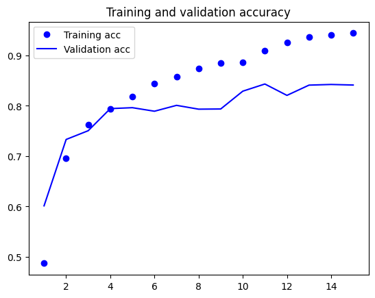
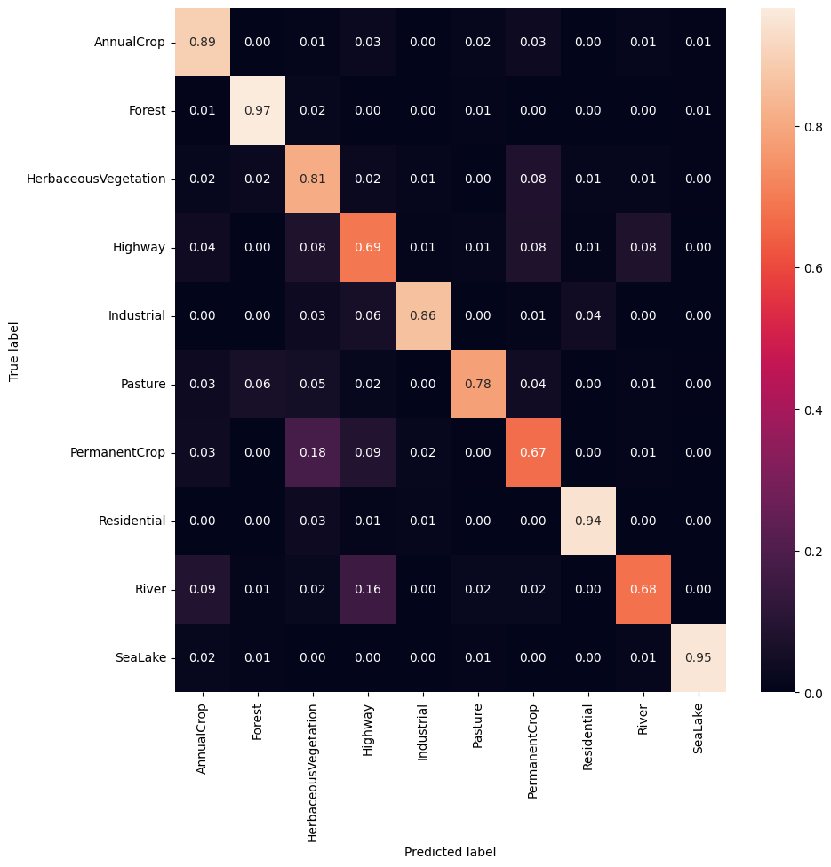
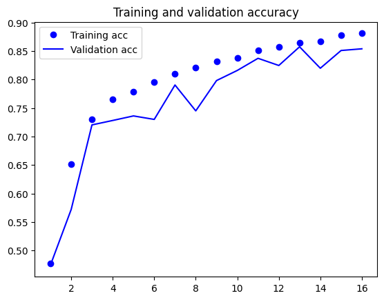
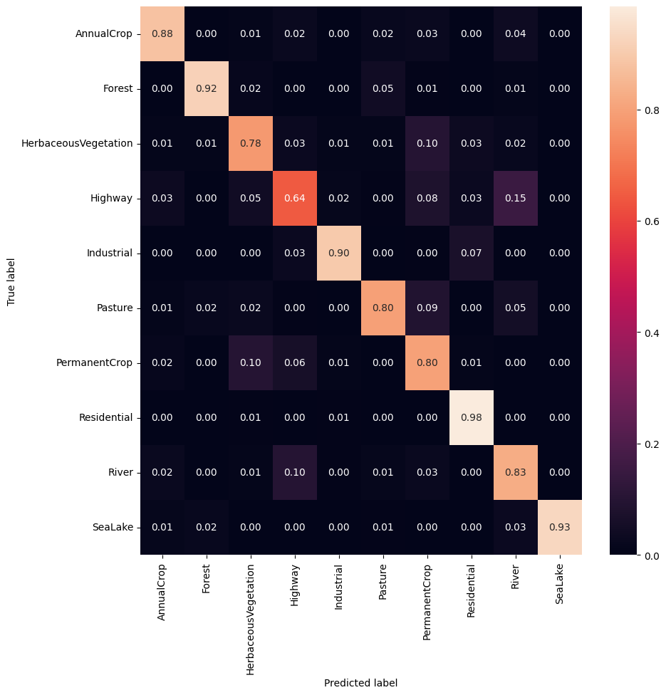
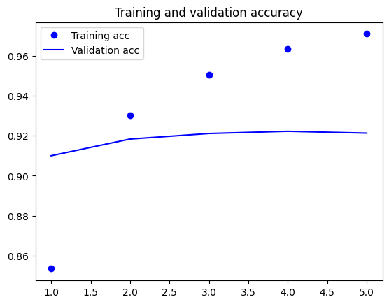
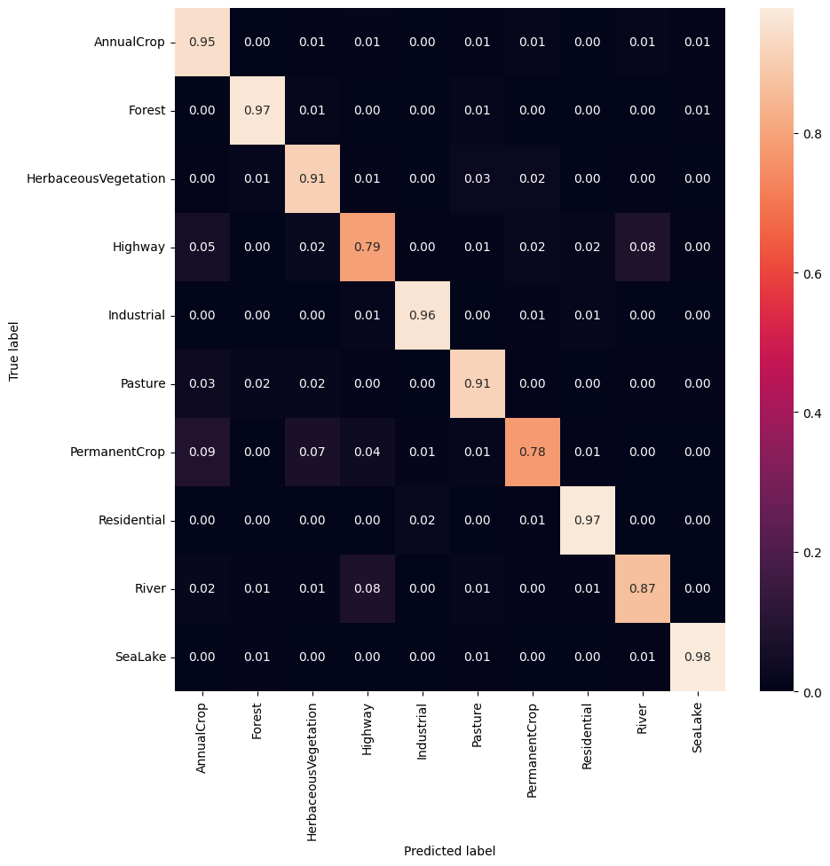

# Eurosat terrain classification
This repository is made for the Predictive Modeling course project at EPF. The goal of the project is to classify the Eurosat dataset using different machine learning algorithms. The dataset is available at https://www.tensorflow.org/datasets/catalog/eurosat

## Exploring the data
We can easily import the images with `tensorflow_datasets` and split them into train, validation and test sets. This gives us the following amounts:

```Python
Number of training samples:  16200
Number of validation samples:  5400
Number of test samples:  5400
```

The first 9 images of the dataset are shown below:


We can see that the size of the images seem very similar, as well as the resolution. The images are also in RGB format. The labels are the following:

```Python
['AnnualCrop', 'Forest', 'HerbaceousVegetation', 'Highway', 'Industrial', 'Pasture', 'PermanentCrop', 'Residential', 'River', 'SeaLake']
```

For peace of mind, we can check size and that the images are indeed in RGB format:

```Python
for image, label in train_ds.take(5):
    print(image.numpy().shape)
```
```Python
(64, 64, 3)
(64, 64, 3)
(64, 64, 3)
(64, 64, 3)
(64, 64, 3)
```

This is very good, as we can use the images as they are without any heavy preprocessing. Having the same size and resolution is necessary for the convolutional neural networks we will use later because they expect a fixed size input.

## Preprocessing
The first thing we do is make sur the size of the images is the same. Then at the same time generate batches of images and labels. We also shuffle the data and normalize the images.

```Python
train_ds = train_ds.map(resize_image).batch(BATCH_SIZE)\
    .prefetch(buffer_size=tf.data.AUTOTUNE)

val_ds = val_ds.map(resize_image).batch(BATCH_SIZE)\
    .prefetch(buffer_size=tf.data.AUTOTUNE)

test_ds = test_ds.map(resize_image).batch(BATCH_SIZE)\
    .prefetch(buffer_size=tf.data.AUTOTUNE)
```

Additionally, in each model we have a rescaling layer that normalizes the images. This is done because we want the RGB values between 0 and 255.

```Python
layers.Rescaling(1./255, input_shape=(img_height, img_width, 3))
```

## Models

We have tried 3 different models. The first one is a simple convolutional neural network. The second one is a more complex and optimized convolutional neural network. The last one is a transfer learning model using the resnet50 model.

For all the models we are using the Adam optimizer and the categorical crossentropy loss function. We are also using the accuracy metric to evaluate the models.

### Simple CNN

The first model is a simple convolutional neural network. It has 3 convolutional layers with 32, 64 and 128 filters respectively. Each convolutional layer is followed by a max pooling layer. The last convolutional layer is followed by a flatten layer and a relu layer with 128 neurons. The output layer is a dense layer with 10 neurons.

```Python
model = models.Sequential([
    layers.Rescaling(1./255, input_shape=(img_height, img_width, 3)),
    layers.Conv2D(32, 3, activation='relu'),
    layers.MaxPooling2D(),
    layers.Conv2D(64, 3, activation='relu'),
    layers.MaxPooling2D(),
    layers.Conv2D(128, 3, activation='relu'),
    layers.MaxPooling2D(),
    layers.Flatten(),
    layers.Dense(128, activation='relu'),
    layers.Dense(10)
])
```

This model gives a test accuracy of `0.83` with 15 epochs. The training and validation accuracy and loss are shown below:



We can see that the model is close to overfitting. This is something we will try to avoid in the next model. The confusion matrix is shown below:



Overall, the model does a good job of classifying the images. The most difficult classes to classify are the PermanentCrop, River and Highway classes. This is probably because these classes are very similar to each other. Maybe a better preprocessing could help with this by using data augmentation. We can verify the global classification with a classification report:

```
                precision    recall  f1-score   support

           0       0.82      0.89      0.85       598
           1       0.92      0.97      0.94       593
           2       0.70      0.81      0.75       611
           3       0.61      0.69      0.65       461
           4       0.94      0.86      0.89       504
           5       0.90      0.78      0.84       446
           6       0.72      0.67      0.69       524
           7       0.94      0.94      0.94       599
           8       0.83      0.68      0.75       493
           9       0.98      0.95      0.96       571

    accuracy                           0.83      5400
   macro avg       0.84      0.82      0.83      5400
weighted avg       0.84      0.83      0.83      5400
```

We can see that every class is pretty well represented.


### Optimized CNN

In this model we try to improve the previous one by using several techniques:

* __Data augmentation__: This consists of generating new images from the existing ones. This is done by applying random transformations to the images. This helps the model generalize better.
* __Dropout__: This is a regularization technique that consists of randomly dropping neurons during training. This prevents the model from converging too quickly to a local minimum.
* __Softmax__: This is a normalization technique that makes the output of the model sum to 1. This is useful because it makes the output of the model more interpretable.
* __Early stopping__: This is a technique that stops the training when the validation loss stops improving. This prevents the model from overfitting.

#### Data augmentation

Here we are using the layers provided by `tensorflow.keras` in order to apply random transformations to the images. We are using the following transformations:

```Python
data_augmentation = models.Sequential([
    layers.experimental.preprocessing.RandomFlip("horizontal", input_shape=(img_height, img_width, 3)),
    layers.experimental.preprocessing.RandomRotation(0.1),
    layers.experimental.preprocessing.RandomZoom(0.1),
])
```

#### Dropout

We are using dropout after the last convolutional layer and before the flatten layer. This is done by adding a dropout layer with a dropout rate of 0.2.

```Python
layers.Dropout(0.2)
```

#### Softmax

We are using the softmax activation function in the output layer simply specifying it in the dense layer.

```Python
layers.Dense(10, activation='softmax')
```

#### Early stopping

Early stopping is implemented by using the `EarlyStopping` callback provided by `tensorflow.keras`. This callback stops the training when the validation loss stops improving and can return the version of the model with the best weights. We are using the following parameters:

```Python
early_stopping = tf.keras.callbacks.EarlyStopping(
    monitor='val_loss', min_delta=0, patience=3, verbose=0,
    mode='auto', baseline=None, restore_best_weights=True
)
```

#### Model

Once we have all the techniques implemented, we can build the model:

```Python
model_aug = models.Sequential([
    data_augmentation,
    layers.Rescaling(1./255),
    layers.Conv2D(32, 3, activation='relu'),
    layers.MaxPooling2D(),
    layers.Conv2D(64, 3, activation='relu'),
    layers.MaxPooling2D(),
    layers.Conv2D(128, 3, activation='relu'),
    layers.MaxPooling2D(),
    layers.Dropout(0.2),
    layers.Flatten(),
    layers.Dense(128, activation='relu'),
    layers.Dense(10, activation='softmax')
])
```

This model gives a test accuracy of `0.85` after stopping the training at epoch 16. Here we can see the training and validation accuracy and loss:



The improvement in accuracy is not very big, but we can see that the model is not overfitting as much as the previous one. Now let's see the confusion matrix:



We can see that the model is doing a better job at classifying the PermanentCrop, River and Highway classes. This is probably because the data augmentation is helping the model generalize better. The only class that is still difficult to classify is the Highway class which is being confused with the River. This is not very surprising as these can also be mistaken by a human with these low-resolution images and very similar colors.

### Transfer learning
In this model, we are using a pre-trained model. We are using the resnet50 model that has been trained on the ImageNet dataset. The benefit of using a pre-trained model is that it has already learned a lot of features from the ImageNet dataset. This means that we can use this model as a starting point and fine-tune it to our dataset. This is much faster than training a model from scratch and it also gives better results. In our case, we are using the resnet50 model as a feature extractor. This means that we are not going to train the model, but we are going to use the features extracted by the model. We are going to add a new output layer with 10 neurons and train it with our dataset.

```Python
from tensorflow.keras.applications import ResNet50

base_model = ResNet50(input_shape=(img_height, img_width, 3),
                        include_top=False,
                        weights='imagenet')

base_model.trainable = False
```

```Python
model_resnet = models.Sequential([
    base_model,
    layers.GlobalAveragePooling2D(),
    layers.Dense(10)
])
```

Now we have a test accuracy nicely improved to `0.91`! The training was only 5 epochs long here is the accuracy and loss:



Already at the first epoch, the validation was the best of all the models. The same improvement can be seen in the confusion matrix:



The model is doing a great job at classifying the images! Nearly all the classes are being predicted correctly over 80% of the time. We can double-check the improvements with the classification report:

```
                precision    recall  f1-score   support

           0       0.85      0.95      0.90       598
           1       0.96      0.97      0.96       593
           2       0.89      0.91      0.90       611
           3       0.83      0.79      0.81       461
           4       0.96      0.96      0.96       504
           5       0.89      0.91      0.90       446
           6       0.90      0.78      0.84       524
           7       0.96      0.97      0.97       599
           8       0.88      0.87      0.88       493
           9       0.98      0.98      0.98       571

    accuracy                           0.91      5400
   macro avg       0.91      0.91      0.91      5400
weighted avg       0.91      0.91      0.91      5400
```


## Conclusion
In this project, we have seen how to use a convolutional neural network to classify images. We have seen how to preprocess the data and how to build a simple CNN. We have also seen how to improve the model by using data augmentation, dropout, softmax and early stopping. Finally, we have seen how to use transfer learning to improve the model even more. The model with the best accuracy was the one using transfer learning. This model gave a test accuracy of `0.91` and a test loss of `0.25`. This is a very good result for a model that was trained with only 5 epochs.
