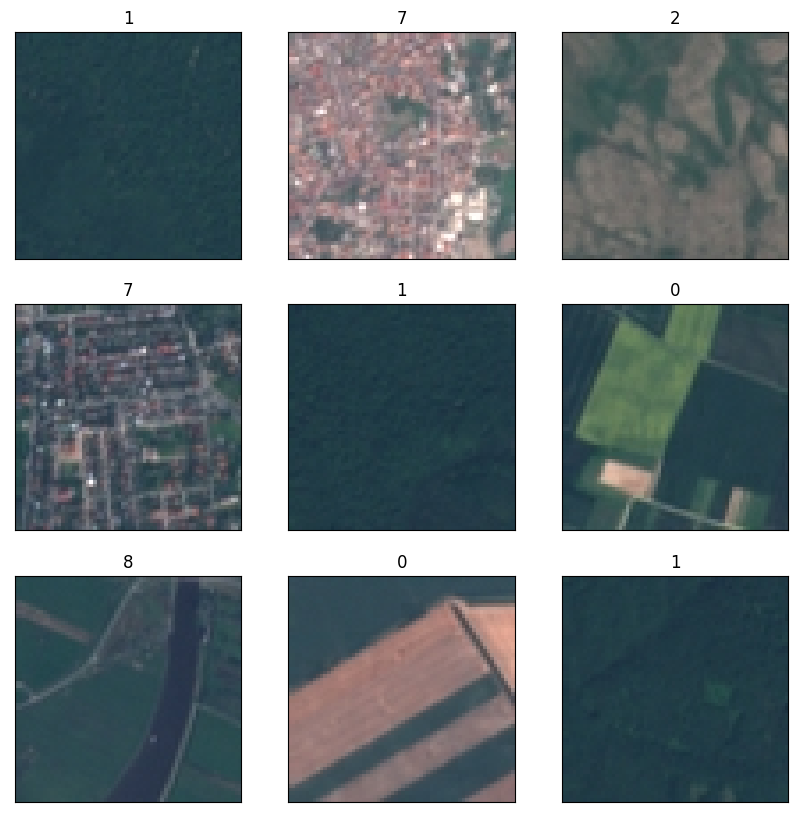

# Eurosat terrain classification
This repository is made for the Predictive Modeling course project at EPF. The goal of the project is to classify the Eurosat dataset using different machine learning algorithms. The dataset is available at https://www.tensorflow.org/datasets/catalog/eurosat

## Exploring the data
We can easily import the images with `tensorflow_datasets` and split them into train, validation and test sets. This gives us the following amounts:

```Python
Number of training samples:  16200
Number of validation samples:  5400
Number of test samples:  5400
```

The first 9 images of the dataset are shown below:



We can see that the size of the images seem very similar, as well as the resolution. The images are also in RGB format. The labels are the following:

```Python
['AnnualCrop', 'Forest', 'HerbaceousVegetation', 'Highway', 'Industrial', 'Pasture', 'PermanentCrop', 'Residential', 'River', 'SeaLake']
```

For peace of mind, we can check size and that the images are indeed in RGB format:

```Python
for image, label in train_ds.take(5):
    print(image.numpy().shape)
```
```Python
(64, 64, 3)
(64, 64, 3)
(64, 64, 3)
(64, 64, 3)
(64, 64, 3)
```

This is very good, as we can use the images as they are without any heavy preprocessing. Having the same size and resolution is necessary for the convolutional neural networks we will use later because they expect a fixed size input.

## Preprocessing
The first thing we do is make sur the size of the images is the same. Then at the same time generate batches of images and labels. We also shuffle the data and normalize the images.

```Python
train_ds = train_ds.map(resize_image).batch(BATCH_SIZE)\
    .prefetch(buffer_size=tf.data.AUTOTUNE)

val_ds = val_ds.map(resize_image).batch(BATCH_SIZE)\
    .prefetch(buffer_size=tf.data.AUTOTUNE)

test_ds = test_ds.map(resize_image).batch(BATCH_SIZE)\
    .prefetch(buffer_size=tf.data.AUTOTUNE)
```